Most software engineers today grow up in a world where AWS, Kubernetes, Kafka, and CI/CD pipelines are the default toolkit. I did too—until I started working on systems in laboratory automation and industrial environments.

Working in this domain has introduced me to a different reality:

> In some production environments, cloud connectivity isn't just unavailable. It's not permitted.

This isn't a critique of those environments, nor a claim that cloud is bad. It's simply an observation about a world that exists alongside—but very differently from—the typical web development experience.

## The Question That Comes Up

When engineers from web, mobile, or cloud-native backgrounds first encounter industrial systems, a natural question arises:

- Why not use S3 for storage?
- Why not use Kafka for messaging?
- Why not centralize logs in the cloud?

These are reasonable questions. In most contexts, using well-established cloud services _is_ the better choice.

But in certain regulated or physically isolated environments, these options aren't available—not because of technical limitations, but because of constraints that exist for valid reasons.

## A Typical Production Environment

In laboratory robotics and automation, production systems often look quite different from typical web architecture. Here's an example:

```mermaid
flowchart TB
    subgraph site["🏭 Customer Site"]
        direction TB
        subgraph pc["💻 Instrument Control PC"]
            direction LR
            app["🖥️ App Server"]
            db[("🗄️ Local DB")]
            logs["📋 Logs"]
        end
        hw{{"⚙️ Hardware Interface"}}
        instruments["🔬 Lab Instruments"]
    end

    cloud(["☁️ Cloud Services"])
    block["🚫 No Internet"]

    app --> db
    app --> logs
    app --> hw
    hw --> instruments
    site -.- block
    block -.-x cloud

    classDef siteStyle fill:#dbeafe,stroke:#2563eb,stroke-width:3px,rx:15,ry:15
    classDef pcStyle fill:#e0f2fe,stroke:#0284c7,stroke-width:2px,rx:10,ry:10
    classDef appStyle fill:#ffffff,stroke:#3b82f6,stroke-width:2px,rx:8,ry:8,color:#1e40af
    classDef dbStyle fill:#fef3c7,stroke:#d97706,stroke-width:2px,color:#92400e
    classDef hwStyle fill:#f0fdf4,stroke:#16a34a,stroke-width:2px,rx:0,ry:0,color:#166534
    classDef instrStyle fill:#dcfce7,stroke:#22c55e,stroke-width:2px,rx:12,ry:12,color:#166534
    classDef cloudStyle fill:#fee2e2,stroke:#dc2626,stroke-width:2px,stroke-dasharray:8,rx:20,ry:20,color:#991b1b
    classDef blockStyle fill:#fef2f2,stroke:#ef4444,stroke-width:2px,rx:8,ry:8,color:#dc2626

    class site siteStyle
    class pc pcStyle
    class app,logs appStyle
    class db dbStyle
    class hw hwStyle
    class instruments instrStyle
    class cloud cloudStyle
    class block blockStyle
```

The "server" is often the same PC that controls physical instruments. The database is local. Logs stay on the machine. There is no connection to the outside world.

## Why This Architecture Exists

From what I've observed, several factors contribute to this pattern:

### 1. Regulatory Requirements

In regulated industries like pharmaceuticals or medical devices, data integrity and traceability are paramount. Standards like FDA 21 CFR Part 11 or GxP guidelines often require strict control over where data resides and how it's accessed.

Cloud storage isn't inherently non-compliant, but achieving compliance in air-gapped environments is often simpler and more predictable.

### 2. Network Isolation by Design

Many facilities intentionally isolate their operational networks from the internet. This isn't paranoia—it's a deliberate security posture for systems that control expensive equipment or sensitive processes.

When a single instrument might cost hundreds of thousands of dollars, the risk calculation around network exposure changes significantly.

### 3. Real-Time Requirements

Some operations require deterministic timing that cloud round-trips can't guarantee. When software needs to coordinate with physical hardware in milliseconds, local execution isn't a preference—it's a necessity.

### 4. Operational Reality

Perhaps most practically: these systems are deployed at customer sites that developers may never physically visit. Updates often require on-site engineers to manually transfer and install software.

## What This Means for Development

Working in these environments requires thinking differently about several things:

### Deployment

Without CI/CD pipelines pushing to cloud infrastructure, deployment becomes a more deliberate process. Release packages need to be self-contained. Installation procedures need to be documented thoroughly. Rollback strategies need to work offline.

### Debugging

When you can't SSH into a production server or check Datadog dashboards, diagnostic capabilities need to be built into the application itself. Comprehensive local logging, self-diagnostic tools, and clear error messages become essential—not nice-to-haves.

### Architecture

Every dependency becomes a question: Can this run entirely locally? What happens if there's no network? How do we update this component without internet access?

The "just add another microservice" approach doesn't translate well when the entire system needs to run on a single machine with no external connectivity.

## This Isn't a Better or Worse Approach

I want to be clear: I'm not arguing that air-gapped industrial systems represent a superior approach to software development. Modern cloud infrastructure exists because it solves real problems effectively.

But I do think it's valuable to recognize that a significant amount of software operates under very different constraints than what's typically discussed in tech blogs or conference talks.

These systems automate laboratory workflows, control manufacturing equipment, run diagnostic instruments in hospitals, and perform countless other functions where reliability and regulatory compliance take precedence over deployment velocity.

## Lessons from This Environment

Working in this space has shaped how I think about a few things:

**Offline scenarios matter.** Even in connected applications, it's worth considering what happens when the network isn't available.

**Diagnostic capabilities are essential.** When you can't rely on external monitoring tools, good local logging and self-diagnostic features become critical—not nice-to-haves.

**Dependencies have operational implications.** Every library or service you add affects deployment, updates, and troubleshooting in ways that aren't always obvious upfront.

**Context matters enormously.** The "right" architecture depends heavily on where and how the software will actually run.

## Closing Thoughts

If you've spent your career in web, mobile, or cloud-native development, encountering an air-gapped industrial system might feel like stepping back in time. No Kubernetes, no cloud databases, no real-time monitoring dashboards.

But these systems exist for reasons that make sense within their context. The engineers building them face real constraints and make thoughtful trade-offs—just different ones than you might be used to.

Understanding this broader landscape doesn't change how you build your next connected application. But it might change how you think about the assumptions underlying modern software development practices—and remind you that there's always more than one way to solve a problem.

_These observations come from my ongoing work in laboratory automation. The specific constraints and approaches vary across different industries and organizations._
