What if scientists could simply *talk* to their lab equipment?

> "Prepare 50 μL aliquots of the sample in wells A1 through A6, then incubate at 37°C for 2 hours."

This kind of natural language instruction is how researchers think about their experiments. Yet traditional lab automation requires precise programming—specific coordinates, exact volumes, explicit timing sequences. Every variation needs new code.

Large Language Models are changing this. They can interpret human *intent* and translate it into executable robotic actions, potentially bridging the gap between how scientists think and how machines operate.

## What Makes LLMs Different?

Unlike traditional automation programming, LLMs offer:


The key capabilities LLMs bring:

- **Natural language understanding**: Interpret commands in the way scientists naturally express them
- **Context awareness**: Understand domain-specific terminology and experimental context
- **Flexible planning**: Decompose high-level goals into step-by-step procedures
- **Error handling**: Respond to unexpected situations with appropriate alternatives

## Real-World Applications and Case Studies

### Autonomous Chemical Research

Perhaps the most compelling demonstration comes from Coscientist, an LLM-driven system that can autonomously design, plan, and execute chemical experiments. Developed by researchers at Carnegie Mellon, Coscientist integrates:

- Web searching for chemical information
- Document retrieval from scientific literature
- Code generation for robotic control
- Direct interaction with lab equipment

In demonstrated experiments, Coscientist successfully optimized palladium-catalyzed cross-coupling reactions—a task that typically requires significant expertise and manual iteration.

Similarly, [ChemCrow](https://github.com/ur-whitelab/chemcrow-public) integrates 18 expert-designed tools to enhance chemical research capabilities, from molecule design to synthesis planning.

### Industrial Quality Control

A 2025 study demonstrated LLM integration in an industrial robotics setting—specifically, snow crab quality inspection. The system combined:

- Speech recognition for voice commands
- Computer vision for real-time perception
- LLM for command interpretation and planning

The results showed **98.46% success rate** in interpreting complex instructions, including trajectory generation and visual queries. This demonstrates that LLM-based control is moving beyond research prototypes into practical industrial applications.

### Accessible Lab Automation

A recent paper in Advanced Intelligent Systems presents a system designed to lower the barrier to lab automation. Key features:

- Natural language interface for non-programmers
- Modular robotic arm integration
- Human-in-the-loop design for safety and adaptability

The emphasis on **collaborative human-AI interaction** rather than full autonomy is particularly relevant for regulated laboratory environments.

## How LLMs Control Robots: Architecture Patterns

### The High-Level Planner Pattern

LLMs excel at semantic understanding but have significant latency (500ms to 5+ seconds per response). The emerging best practice separates concerns:

```mermaid
flowchart TB
    subgraph user["👤 User Input"]
        voice["Voice Command"]
        text["Text Command"]
    end

    subgraph llm_layer["🧠 LLM Layer (Semantic Planning)"]
        interpret["Command Interpretation"]
        plan["Task Decomposition"]
        code_gen["Code/Action Generation"]
    end

    subgraph control["⚙️ Control Layer (Execution)"]
        ros["ROS 2 / MoveIt"]
        traj["Trajectory Planning"]
        safety["Safety Checks"]
    end

    subgraph robot["🤖 Robot"]
        hw["Hardware Interface"]
        sensors["Sensor Feedback"]
    end

    voice --> interpret
    text --> interpret
    interpret --> plan
    plan --> code_gen
    code_gen --> ros
    ros --> traj
    traj --> safety
    safety --> hw
    sensors --> ros

    classDef userStyle fill:#fef3c7,stroke:#d97706,stroke-width:2px,rx:10,ry:10
    classDef llmStyle fill:#d1fae5,stroke:#059669,stroke-width:2px,rx:10,ry:10
    classDef controlStyle fill:#dbeafe,stroke:#2563eb,stroke-width:2px,rx:10,ry:10
    classDef robotStyle fill:#f3e8ff,stroke:#7c3aed,stroke-width:2px,rx:10,ry:10
    classDef nodeStyle fill:#ffffff,stroke:#6b7280,stroke-width:1px,rx:5,ry:5

    class user userStyle
    class llm_layer llmStyle
    class control controlStyle
    class robot robotStyle
    class voice,text,interpret,plan,code_gen,ros,traj,safety,hw,sensors nodeStyle
```



This separation is crucial:
- **LLM**: Decides *what* to do (semantic planning)
- **Traditional control stack**: Decides *how* to move (motion planning, safety)

### Key Frameworks

**ELLMER** (Nature Machine Intelligence, 2025): Separates high-level LLM planning from robot control. The LLM generates Python code based on user requests and image feedback, enabling flexible response to ambiguous instructions.

**CLEAR** (Context-observant LLM-Enabled Autonomous Robots): Uses natural language for both perception and action. System behavior is defined through prompting rather than code changes.

**ROSA**: A layer on top of LangChain designed for ROS/ROS 2 integration, allowing LLMs to interact directly with robotic middleware.

### Performance Reality Check

Recent experimental evaluations show:

| Metric | Performance |
|--------|-------------|
| Command interpretation accuracy | 82-92% |
| Executable code generation | >80% success rate |
| Task completion (variable conditions) | 85-92% |
| Deployment time reduction | 98.3% vs traditional |

However, important caveats apply:
- LLMs can "hallucinate" impossible actions
- They lack physical intuition about geometry and dynamics
- Real-time control requires traditional methods

## The Air-Gapped Challenge

As I've discussed in [previous posts](/posts/dev-practices/industrial-software-without-cloud), many laboratory environments operate without internet connectivity. This presents a fundamental challenge for LLM deployment:

```mermaid
flowchart TB
    subgraph cloud["☁️ Cloud LLMs"]
        gpt["GPT-4 / Claude"]
        api["API Access"]
        latency1["~1-5s latency"]
    end

    subgraph local["🏭 Air-Gapped Lab"]
        pc["Windows Workstation"]
        network["🚫 No Internet"]
        requirement["Real-time Requirements"]
    end

    gap{{"Deployment Gap"}}

    cloud --> gap
    local --> gap

    classDef cloudStyle fill:#dbeafe,stroke:#2563eb,stroke-width:2px,rx:10,ry:10
    classDef localStyle fill:#fee2e2,stroke:#dc2626,stroke-width:2px,rx:10,ry:10
    classDef gapStyle fill:#fef3c7,stroke:#d97706,stroke-width:3px

    class cloud cloudStyle
    class local localStyle
    class gap gapStyle
```



The solution: **Small Language Models (SLMs)** that can run locally.

## Small LLMs for Edge Deployment

The field has made remarkable progress in creating capable models that run on standard hardware:

### Leading Small Models (2025)

| Model | Size | Key Strength | Memory (4-bit) |
|-------|------|--------------|----------------|
| **Qwen3-0.6B** | 0.6B | Smallest with strong reasoning | ~0.5GB |
| **Phi-4** | 14B | Quality over size (synthetic data) | ~7GB |
| **Llama 3.2** | 1B-3B | Instruction following | 1-2GB |
| **Mistral Small** | 7B | Efficiency + multilingual | ~4GB |
| **DeepSeek-V3.2** | MoE | Reasoning + agentic tasks | Varies |

[According to recent benchmarks](https://huggingface.co/blog/daya-shankar/open-source-llms), open-weight models now trail proprietary models by only about three months on average.

### Quantization: The Enabler

4-bit quantization has become the standard for edge deployment:

```
Original (FP16):  14B params × 2 bytes = ~28GB
Quantized (4-bit): 14B params × 0.5 bytes = ~7GB
```

Studies show that quantized 4-7B models achieve **90-95% of cloud baseline accuracy** while reducing inference energy by 50-80%.

### Hardware Requirements

For lab automation workstations:

| RAM | Suitable Models | Use Cases |
|-----|-----------------|-----------|
| 8-16GB | 7B (Q4/Q5) | Basic command interpretation |
| 16-32GB | 7B-14B | Complex planning, reasoning |
| 32-64GB | 14B-32B | Multi-step task orchestration |

[NVIDIA Jetson Orin](https://developer.nvidia.com/blog/getting-started-with-edge-ai-on-nvidia-jetson-llms-vlms-and-foundation-models-for-robotics/) provides dedicated edge AI capability with >100 TFLOPS for deep learning workloads.

### Local Inference Tools

- **[Ollama](https://ollama.com)**: Simplest option for running quantized LLMs locally
- **LM Studio**: GUI-based with model management
- **llama.cpp**: CPU-optimized inference
- **ONNX Runtime**: Enterprise deployment with TensorRT/OpenVINO

## Practical Architecture for Lab Automation

Given the constraints, here's a viable architecture:

```mermaid
flowchart TB
    subgraph site["🏭 Laboratory Site"]
        subgraph workstation["💻 Instrument Control PC"]
            app["Lab Automation Software"]
            voice["🎤 Voice Interface"]
        end

        subgraph inference["🖥️ Local Inference Server"]
            llm["Small LLM (7-14B)"]
            planner["Task Planner"]
            safety["Safety Validator"]
        end

        subgraph control["⚙️ Robot Controller"]
            ros["ROS 2"]
            motion["Motion Planning"]
        end

        instruments["🔬 Lab Instruments"]
    end

    voice -->|"Natural Language"| llm
    app -->|"Commands"| llm
    llm --> planner
    planner --> safety
    safety --> ros
    ros --> motion
    motion --> instruments
    instruments -->|"Status"| app

    classDef siteStyle fill:#f0f9ff,stroke:#0284c7,stroke-width:3px,rx:15,ry:15
    classDef workstationStyle fill:#dbeafe,stroke:#2563eb,stroke-width:2px,rx:10,ry:10
    classDef inferenceStyle fill:#d1fae5,stroke:#059669,stroke-width:2px,rx:10,ry:10
    classDef controlStyle fill:#fef3c7,stroke:#d97706,stroke-width:2px,rx:10,ry:10
    classDef instrStyle fill:#f3e8ff,stroke:#7c3aed,stroke-width:2px,rx:10,ry:10
    classDef nodeStyle fill:#ffffff,stroke:#6b7280,stroke-width:1px,rx:5,ry:5

    class site siteStyle
    class workstation workstationStyle
    class inference inferenceStyle
    class control controlStyle
    class instruments instrStyle
    class app,voice,llm,planner,safety,ros,motion nodeStyle
```



Key design decisions:

1. **Separate inference server**: Dedicated hardware for LLM, isolated from instrument control
2. **Safety validation layer**: All LLM outputs pass through deterministic safety checks
3. **Human-in-the-loop**: Confirmation required for critical operations
4. **Fallback mode**: System operates traditionally if LLM is unavailable

## Current State of the Art (2025)

### Model Landscape

[According to the Open LLM Leaderboard](https://www.vellum.ai/open-llm-leaderboard):

- **DeepSeek-R1 (671B MoE)**: Leading in reasoning and mathematical tasks
- **Llama 3.1 405B**: Best general-purpose open model
- **Qwen 3**: Strong multilingual support, available in small sizes
- **Mistral/Mixtral**: Exceptional efficiency and speed

### Benchmarks and Reality

Important context on benchmarks:

> A significant number of SOTA models currently achieve over 90% accuracy on well-known benchmarks like MMLU and MATH, making differentiation challenging.

Newer, harder benchmarks like **Humanity's Last Exam** (expert-level questions across 100+ disciplines) show even frontier models scoring below 50%.

For lab automation specifically, the relevant metrics are:
- Command interpretation accuracy
- Safe action generation
- Recovery from errors
- Domain-specific knowledge

### What's Coming

- **Agentic capabilities**: LLMs that can use tools, search documentation, and iterate on solutions
- **Multimodal integration**: Combining LLMs with vision capabilities (VLMs) for visual understanding
- **Domain-specific fine-tuning**: Models trained on laboratory protocols and scientific literature
- **Improved efficiency**: Continued shrinking of capable models

## Considerations for Adoption

### Technical Challenges

**Latency**: Even small LLMs have 100-500ms inference times. For real-time control, LLMs should handle planning while traditional controllers handle execution.

**Reliability**: LLMs can generate plausible but incorrect actions. Every output needs validation against known safe operations.

**Consistency**: The same prompt may produce different outputs. For regulated environments, this needs careful handling.

### Regulatory Considerations

- How are AI-generated commands documented in audit trails?
- What validation is required for the model itself?
- How do you demonstrate reproducibility with probabilistic systems?

### Practical Starting Points

1. **Start with interpretation, not control**: Use LLMs to parse natural language into structured commands, with traditional systems executing
2. **Build comprehensive safety layers**: Never execute LLM outputs directly
3. **Maintain fallback modes**: The system should work without the LLM
4. **Log everything**: Every LLM interaction for traceability

## Closing Thoughts

LLMs represent a genuine paradigm shift in how humans can interact with laboratory automation. The ability to express intent in natural language—rather than precise programming syntax—could make automation accessible to more researchers and accelerate experimental workflows.

But the path from "impressive demo" to "validated production system" requires careful engineering. The models are capable; the challenge is building the infrastructure around them that ensures safety, reliability, and compliance in regulated environments.

For those of us working in industrial automation, the question is no longer whether LLMs will be part of our systems—it's how we'll integrate them thoughtfully, respecting the constraints that exist for good reasons.

_This is a rapidly evolving field. The specific models and benchmarks mentioned here will likely be superseded within months, but the architectural patterns and integration considerations should remain relevant._

---

**Further Reading:**

- [Awesome LLM Robotics - GitHub](https://github.com/GT-RIPL/Awesome-LLM-Robotics)
- [ChemCrow - GitHub](https://github.com/ur-whitelab/chemcrow-public)
- [Open LLM Leaderboard - Vellum](https://www.vellum.ai/open-llm-leaderboard)
- [Best Open-Source LLMs - Hugging Face](https://huggingface.co/blog/daya-shankar/open-source-llms)
- [NVIDIA Jetson Edge AI Guide](https://developer.nvidia.com/blog/getting-started-with-edge-ai-on-nvidia-jetson-llms-vlms-and-foundation-models-for-robotics/)
