Most software engineers today work with clean, well-documented APIs: REST endpoints, gRPC services, and NuGet packages with full IntelliSense support.

In industrial robotics and laboratory automation, the integration story is different. Here, you work with vendor-provided SDKs—often delivered as .NET assemblies (C# DLLs)—that serve as the bridge between your software and physical hardware.

These SDKs aren't inherently problematic. They represent years of work by hardware engineers who understand their devices deeply. But they do require a different mindset than consuming a typical web API or open-source library.

This post shares some lessons I've learned while working on these integrations.

## The Nature of Hardware SDKs

When integrating lab instruments or robotic devices, vendors typically provide:

- .NET assemblies (C# DLLs)
- Reference documentation (sometimes dated)
- Sample applications
- Occasionally, source code for the samples

The first thing to understand is that these SDKs are designed with different constraints in mind. Hardware vendors prioritize:

- **Long-term stability** over frequent updates
- **Regulatory compliance** over API ergonomics
- **Proven behavior** over comprehensive edge case coverage

This isn't a criticism—it's simply a different set of trade-offs. A certified medical device SDK that hasn't changed in five years might be exactly what a regulated environment needs.

## Working with Vendor-Provided .NET SDKs

Vendor SDKs delivered as .NET assemblies simplify some aspects of integration, but introduce their own considerations.

### Assembly and Dependency Management

Vendor SDKs often come as a collection of DLLs that need to be deployed together:

```
/lib
  ├── VendorDevice.dll        # Main SDK assembly
  ├── VendorDevice.Core.dll   # Internal dependencies
  ├── VendorDevice.Comm.dll   # Communication layer
  └── ThirdParty.Lib.dll      # Third-party dependencies
```

A few things I've learned to watch for:

- **Target framework compatibility** — Some vendor DLLs target .NET Framework 4.x and may not work seamlessly with .NET Core/5+. You might need compatibility shims or separate hosting
- **Dependency conflicts** — The SDK might bundle older versions of common libraries (Newtonsoft.Json, logging frameworks) that conflict with your application's dependencies
- **Assembly versioning** — When the vendor updates their SDK, binding redirects or explicit version management may be needed
- **Deployment considerations** — Ensure all dependent assemblies are copied to your output directory; missing DLLs at runtime can be frustrating to debug

### Threading and Synchronization

Even managed SDKs often have threading requirements that aren't obvious from the API:

```csharp
public class DeviceController
{
    private readonly VendorDevice _device;
    private readonly SemaphoreSlim _lock = new(1, 1);

    public async Task<Result> ExecuteCommandAsync(Command cmd)
    {
        // Some SDKs aren't thread-safe
        await _lock.WaitAsync();
        try
        {
            return await Task.Run(() => _device.Execute(cmd));
        }
        finally
        {
            _lock.Release();
        }
    }
}
```

I've seen issues where code worked perfectly in a single-threaded test but failed under concurrent access—simply because the SDK wasn't designed for multi-threaded use.

**What helps:** Understanding the SDK's threading model upfront, and designing your integration layer to enforce those constraints rather than hoping for the best.

### Resource Cleanup and Lifecycle

Vendor SDKs often hold resources that need explicit cleanup—connections, handles, or internal state:

```csharp
public class DeviceManager : IDisposable
{
    private readonly VendorDevice _device;
    private bool _initialized;

    public async Task InitializeAsync()
    {
        // Some SDKs require initialization in a specific order
        await Task.Run(() =>
        {
            _device.SetLicenseKey("...");  // Often required first
            _device.Initialize();           // May block for seconds
            _device.RegisterCallback(OnDeviceEvent);
        });
        _initialized = true;
    }

    public void Dispose()
    {
        // Cleanup order often matters
        if (_initialized)
        {
            _device.UnregisterCallback(OnDeviceEvent);
            _device.Shutdown();  // May also block
        }
    }
}
```

**What helps:** Implementing `IDisposable` carefully, and testing what happens when your application shuts down unexpectedly. Some SDKs don't handle abrupt termination gracefully.

### Environment and Configuration

Vendor SDKs can be sensitive to their runtime environment:

- **Platform architecture** — x86 vs x64 (especially if the managed SDK wraps native code internally)
- **.NET runtime version** — Specific CLR requirements
- **Configuration files** — Some SDKs expect config files in specific locations
- **License files or dongles** — Hardware or file-based licensing requirements

**What helps:** Documenting the exact environment requirements, and automating the setup process as much as possible. What works on a developer machine should work identically on a production system.

### Error Handling and Diagnostics

Hardware SDK errors can be cryptic. Vendor-defined exception types or error codes may not be well documented:

```csharp
try
{
    device.Execute(command);
}
catch (VendorDeviceException ex)
{
    // Error code 0x8004 could mean... many things
    _logger.LogError(ex, "Device error: {Code} - {Message}",
        ex.ErrorCode, ex.Message);
    throw new DeviceOperationException(
        TranslateErrorCode(ex.ErrorCode), ex);
}
```

**What helps:** Building comprehensive logging around SDK calls. When something fails in production, you'll want to know exactly what was called, with what parameters, and what the device state was at the time.

### Event Handling and Callbacks

Vendor SDKs frequently use events to report device status. These often fire from background threads:

```csharp
public class DeviceAdapter
{
    private readonly SynchronizationContext? _syncContext;

    public DeviceAdapter()
    {
        // Capture the UI context if needed
        _syncContext = SynchronizationContext.Current;
    }

    private void OnDeviceEvent(object sender, DeviceEventArgs e)
    {
        // SDK callbacks may come from arbitrary threads
        if (_syncContext != null)
        {
            _syncContext.Post(_ => HandleEvent(e), null);
        }
        else
        {
            HandleEvent(e);
        }
    }
}
```

### Wrapping Vendor Types

Creating your own abstractions over vendor types has value:

```csharp
// Vendor SDK types leak into your domain
public class BadExample
{
    public VendorDevice Device { get; }  // Direct vendor dependency
}

// Better: wrap in your own abstractions
public interface IDevice
{
    DeviceStatus Status { get; }
    Task<OperationResult> ExecuteAsync(DeviceCommand command);
}

public class VendorDeviceAdapter : IDevice
{
    private readonly VendorDevice _vendorDevice;

    public DeviceStatus Status =>
        TranslateStatus(_vendorDevice.GetStatus());
}
```

This isolation pays off when vendor SDK updates introduce breaking changes, or when you need to support multiple device vendors behind a unified interface.

## Architectural Patterns That Have Helped

### The Adapter Layer

Rather than calling SDK methods directly throughout your codebase, it's worth creating an abstraction layer:


This abstraction provides several benefits:

- **Testability** — You can mock the adapter interface for unit tests
- **Consistency** — Error handling, logging, and timeout policies in one place
- **Flexibility** — Easier to support multiple device vendors behind the same interface
- **Isolation** — SDK updates don't ripple through your entire codebase

### State Machine Modeling

Physical devices have states that matter: initializing, ready, busy, error, disconnected. The SDK might not model these states explicitly, but your application needs to track them.

```mermaid
flowchart TB
    subgraph connection["Connection"]
        disc(["🔌 Disconnected"])
        init(["⏳ Initializing"])
    end

    subgraph operation["Operation"]
        ready(["✅ Ready"])
        busy(["⚙️ Busy"])
    end

    err(["❌ Error"])

    disc -->|Connect| init
    init -->|Success| ready
    init -.->|Failed| err
    ready -->|Start| busy
    busy -->|Complete| ready
    busy -.->|Failed| err
    err -->|Reset| init
    err -->|Disconnect| disc
    ready -->|Disconnect| disc

    classDef connectionBox fill:#f0f9ff,stroke:#0284c7,stroke-width:2px,rx:12,ry:12
    classDef operationBox fill:#f0fdf4,stroke:#16a34a,stroke-width:2px,rx:12,ry:12
    classDef disconnected fill:#f3f4f6,stroke:#6b7280,stroke-width:2px,color:#374151
    classDef initializing fill:#fef3c7,stroke:#d97706,stroke-width:2px,color:#92400e
    classDef ready fill:#d1fae5,stroke:#059669,stroke-width:2px,color:#065f46
    classDef busy fill:#dbeafe,stroke:#2563eb,stroke-width:2px,color:#1e40af
    classDef error fill:#fee2e2,stroke:#dc2626,stroke-width:2px,color:#991b1b

    class connection connectionBox
    class operation operationBox
    class disc disconnected
    class init initializing
    class ready ready
    class busy busy
    class err error
```



I've found it valuable to build explicit state machines for device management, even when the underlying SDK uses simpler callback or polling patterns. This makes the device behavior predictable and debuggable.

### Defensive Timeout Policies

Hardware operations can hang. Networks can drop. Devices can become unresponsive. SDKs don't always handle these cases the way you'd expect.

Wrapping SDK calls with explicit timeouts—and deciding what to do when they trigger—is time well spent. Consider:

- **Connection timeouts** — How long to wait for initial device connection
- **Operation timeouts** — Maximum time for a single command to complete
- **Health check intervals** — Periodic polling to detect silent failures
- **Recovery strategies** — What to do when timeouts occur (retry, reset, escalate)

## What I Wish I'd Known Earlier

**Read the sample code carefully.** Often the vendor's demo application contains subtle patterns that aren't documented elsewhere. How they initialize components, in what order, and how they handle shutdown can be instructive.

**Test on clean machines.** Developer machines accumulate dependencies over time. Testing your integration on a fresh VM will reveal missing prerequisites before your customers do.

**Plan for the SDK update cycle.** Hardware vendors don't update SDKs frequently, but when they do, it can be disruptive. An abstraction layer helps, but also keep notes on what SDK behavior your code depends on.

**Build good diagnostics from the start.** When a device stops working at a customer site, your logs are often your only window into what happened. Include timestamps, operation sequences, and device state in every log entry.

**Expect the unexpected.** Physical devices exist in the real world. They can be power-cycled mid-operation, disconnected without warning, or behave differently based on environmental factors. Design for graceful degradation.

## Conclusion

Integrating vendor-provided SDKs isn't inherently harder than working with modern web APIs—it's just different. The technologies are mature and capable. The challenges come from bridging different design philosophies and operational assumptions.

The engineers who do this well tend to approach it with curiosity rather than frustration. Understanding why an SDK works the way it does—given the constraints its developers faced—often leads to better integration designs.

In the end, the goal is the same as any integration work: build a clean interface that your application can rely on, and handle the complexity at the boundary where it belongs.
