Laboratory automation has traditionally relied on explicit programming: if you want a robot to detect contamination in a cell culture, you build a specialized classifier for that exact task. Want to check equipment status? Build another model. Every new visual inspection requirement means new development work.

Vision-Language Models (VLMs) offer a different approach. Instead of training specialized models for each task, what if you could simply *ask* the system: "Is there any contamination in this culture?" or "What's the current status of the incubator display?"

This capability is becoming increasingly relevant as VLMs mature. But there's a significant gap between what's possible in cloud-connected environments and what's practical in regulated industrial settings where internet connectivity often isn't available.

## What Are Vision-Language Models?

Vision-Language Models (VLMs) are AI systems that can process both images and text simultaneously. Unlike traditional computer vision that outputs classifications or bounding boxes, VLMs can:

- Answer natural language questions about images
- Describe visual content in detail
- Understand documents containing both text and diagrams
- Reason about visual information in context

The key insight is that VLMs don't just "see" an image—they can engage in a conversation about what they see, making them far more flexible than traditional CV approaches.

```mermaid
flowchart LR
    subgraph input["Input"]
        img["🖼️ Image"]
        text["💬 Question"]
    end

    subgraph vlm["Vision-Language Model"]
        vision["Vision Encoder"]
        fusion["Multimodal Fusion"]
        llm["Language Model"]
    end

    subgraph output["Output"]
        response["📝 Natural Language Response"]
    end

    img --> vision
    text --> llm
    vision --> fusion
    llm --> fusion
    fusion --> response

    classDef inputStyle fill:#dbeafe,stroke:#2563eb,stroke-width:2px,rx:10,ry:10
    classDef vlmStyle fill:#d1fae5,stroke:#059669,stroke-width:2px,rx:10,ry:10
    classDef outputStyle fill:#fef3c7,stroke:#d97706,stroke-width:2px,rx:10,ry:10
    classDef nodeStyle fill:#ffffff,stroke:#6b7280,stroke-width:1px,rx:5,ry:5

    class input inputStyle
    class vlm vlmStyle
    class output outputStyle
    class img,text,vision,fusion,llm,response nodeStyle
```



## Where VLMs Are Making an Impact

Before diving into lab automation specifics, it's worth understanding where VLMs are already proving valuable:

### Manufacturing Quality Control

MaViLa, a VLM specifically designed for smart manufacturing, demonstrates how domain-specific models can outperform general-purpose ones in industrial settings. It uses retrieval-augmented generation (RAG) to incorporate manufacturing knowledge during inference.

### Robotics and Physical Automation

The emergence of Vision-Language-Action (VLA) models marks a significant evolution. Models like:

- **π0 (pi-zero)** by Physical Intelligence: Trained on trajectories from 8 different robot embodiments
- **Gemini Robotics** by Google DeepMind: Extending multimodal capabilities to physical robot control
- **GR00T N1** by NVIDIA: Industrial-scale VLA for robotic manipulation

These represent a shift from VLMs that merely describe what they see to models that can translate visual understanding into physical actions.

### Document and Instrument Understanding

VLMs excel at interpreting complex visual information that combines text, diagrams, and context—exactly what you'd find in laboratory settings: instrument readouts, chromatography results, cell culture images, and equipment status displays.

## Lab Automation Use Cases

In laboratory environments, VLMs could address several recurring challenges:

### Visual Quality Assessment

```
[Cell Culture Image] + "Is this culture ready for passage?"
                     ↓ VLM
"The confluence appears to be approximately 80-85%. There are
 no visible signs of contamination. The culture is suitable
 for passage, though monitoring for another 4-6 hours would
 be reasonable if higher confluence is desired."
```

Traditional CV requires training specific models for each assessment type. VLMs can potentially handle diverse visual queries with a single model.

### Equipment Status Monitoring

Rather than building custom integrations for every instrument's display, a VLM could:

- Read instrument screens and extract relevant values
- Identify error states or warning indicators
- Detect physical anomalies (misaligned components, missing consumables)
- Verify setup correctness before automated runs

### Protocol Assistance

Lab protocols often include diagrams and images. A VLM could:

- Interpret procedural diagrams and translate them into actionable steps
- Compare actual setup photos against expected configurations
- Assist with troubleshooting by analyzing images of problematic results

### Anomaly Detection

Perhaps most valuable: "Is anything unusual here?"

Unlike rule-based systems that only catch what you've explicitly programmed, VLMs can potentially identify unexpected issues—an unusual color in a reaction, debris in a sample, or equipment positioned incorrectly.

## The Deployment Challenge

Here's where theory meets the reality I've discussed in previous posts. Most cutting-edge VLMs are:

- Cloud-hosted (requiring internet connectivity)
- Computationally expensive (requiring GPUs)
- Large (tens of billions of parameters)

Meanwhile, laboratory automation environments often have:

- No internet connectivity (by design)
- Standard workstation hardware (no dedicated GPUs)
- Strict validation requirements for any software changes

```mermaid
flowchart TB
    subgraph cloud["☁️ Typical VLM Deployment"]
        api["Cloud API"]
        gpu["GPU Cluster"]
        model_large["70B+ Parameter Model"]
    end

    subgraph lab["🏭 Lab Environment"]
        pc["Windows Workstation"]
        network["🚫 Air-Gapped Network"]
        validation["Validation Requirements"]
    end

    gap{{"Gap"}}

    cloud --> gap
    lab --> gap

    classDef cloudStyle fill:#dbeafe,stroke:#2563eb,stroke-width:2px,rx:10,ry:10
    classDef labStyle fill:#fee2e2,stroke:#dc2626,stroke-width:2px,rx:10,ry:10
    classDef gapStyle fill:#fef3c7,stroke:#d97706,stroke-width:3px
    classDef nodeStyle fill:#ffffff,stroke:#6b7280,stroke-width:1px,rx:5,ry:5

    class cloud cloudStyle
    class lab labStyle
    class gap gapStyle
    class api,gpu,model_large,pc,network,validation nodeStyle
```



## Bridging the Gap: Small VLMs and Edge Deployment

The good news: the field is actively addressing this challenge. Several developments make local VLM deployment increasingly viable:

### Smaller, Capable Models

Recent research shows that with proper training, [small VLMs of 2-4B parameters can rival models of 7B+ parameters](https://huggingface.co/blog/vlms-2025). Notable examples:

| Model | Size | Key Strength |
|-------|------|--------------|
| [SmolVLM](https://huggingface.co/blog/smolvlm) | 2B | Browser/edge deployment |
| [FastVLM (Apple)](https://machinelearning.apple.com/research/fast-vision-language-models) | ~3B | Real-time on-device inference |
| Moondream2 | 1.6B | Compact, edge-friendly |
| Qwen2.5-VL | 3B | Long context, balanced capability |

### Quantization and Optimization

4-bit quantized models can run on consumer hardware. A 3B parameter model quantized to 4-bit requires roughly 1.5GB of memory—well within reach of standard workstations.


### Local Inference Frameworks

Tools designed for local deployment:

- **[Ollama](https://ollama.com)**: Cross-platform framework for running LLMs/VLMs locally
- **ONNX Runtime**: Microsoft's engine with TensorRT and OpenVINO acceleration
- **llama.cpp**: CPU-optimized inference for consumer hardware

### Hardware Options

For environments that can accommodate dedicated hardware:

- **NVIDIA Jetson**: [Edge AI platform supporting VLMs like VILA-2.7B](https://developer.nvidia.com/blog/getting-started-with-edge-ai-on-nvidia-jetson-llms-vlms-and-foundation-models-for-robotics/)
- **Intel NUCs with NPUs**: Neural Processing Units for accelerated inference
- **Apple Silicon Macs**: Surprisingly capable for local ML inference

## A Practical Architecture

Given these constraints, here's an architecture that could work in air-gapped lab environments:

```mermaid
flowchart TB
    subgraph site["🏭 Lab Site"]
        subgraph workstation["💻 Instrument Control PC"]
            app["Lab Automation Software"]
            camera["📷 Camera Interface"]
        end

        subgraph edge["🖥️ Edge Inference Server"]
            vlm["Small VLM (2-4B)"]
            cache["Response Cache"]
            queue["Request Queue"]
        end

        instruments["🔬 Lab Instruments"]
    end

    camera -->|"Images"| queue
    app -->|"Queries"| queue
    queue --> vlm
    vlm --> cache
    cache -->|"Results"| app
    app --> instruments

    classDef siteStyle fill:#f0f9ff,stroke:#0284c7,stroke-width:3px,rx:15,ry:15
    classDef workstationStyle fill:#dbeafe,stroke:#2563eb,stroke-width:2px,rx:10,ry:10
    classDef edgeStyle fill:#d1fae5,stroke:#059669,stroke-width:2px,rx:10,ry:10
    classDef nodeStyle fill:#ffffff,stroke:#6b7280,stroke-width:1px,rx:5,ry:5
    classDef instrStyle fill:#f3e8ff,stroke:#7c3aed,stroke-width:2px,rx:10,ry:10

    class site siteStyle
    class workstation workstationStyle
    class edge edgeStyle
    class instruments instrStyle
    class app,camera,vlm,cache,queue nodeStyle
```



Key considerations:

1. **Separation of concerns**: The inference server is separate from the instrument control PC, allowing independent updates and resource management

2. **Asynchronous processing**: A queue handles variable inference times without blocking instrument operations

3. **Caching**: Common queries can be cached to reduce repeated inference

4. **Fallback behavior**: The system should function (perhaps with degraded capability) if the VLM is unavailable

## Current State of the Art (2025)

For those evaluating VLM options, here's the current landscape:

### Leading Open-Source Models

According to [recent benchmarks](https://huggingface.co/blog/vlms-2025):

- **InternVL3-78B**: Highest performing open-source VLM (72.2 on MMMU benchmark)
- **Qwen2.5-VL**: Strong balance of capability and efficiency
- **LLaMA 3.2 Vision**: Meta's multimodal offering
- **DeepSeek-VL2**: Mixture-of-experts architecture

### Reasoning-Capable Models

New in 2025: VLMs with explicit reasoning capabilities:

- **QVQ-72B-preview** (Qwen): First open-source multimodal reasoning model
- **Kimi-VL-A3B-Thinking**: Efficient reasoning with only 2.8B active parameters (MoE)

### Small Model Leaders

For edge deployment:

- **[SAIL-VL](https://arxiv.org/abs/2501.05952)**: State-of-the-art in 2B and 8B categories
- **PaliGemma 3B**: Google's efficient multimodal model
- **Phi-3.5 Vision**: Microsoft's small but capable offering

## What I'm Watching

Several developments could significantly impact VLM adoption in industrial settings:

### Specialized Industrial Models

Like MaViLa for manufacturing, we may see VLMs fine-tuned specifically for laboratory domains—trained on microscopy images, chromatography results, and equipment displays.

### Hybrid Architectures

[Cloud-edge collaborative approaches](https://arxiv.org/html/2502.07855v1) could allow complex queries to be escalated while keeping routine operations local.

### Validation-Friendly Deployment

For regulated environments, deterministic inference (same input → same output) and comprehensive logging will be essential. Some frameworks are beginning to address this.

### Improved Real-Time Performance

[FastVLM](https://machinelearning.apple.com/research/fast-vision-language-models) and similar research focused on latency could enable real-time visual monitoring applications.

## Considerations for Adoption

If you're evaluating VLMs for laboratory automation, some questions worth considering:

**Accuracy requirements**: For critical decisions, what level of confidence is needed? VLMs can hallucinate, and their outputs need appropriate validation.

**Regulatory implications**: How will AI-assisted decisions be documented? What validation is required for the model itself?

**Fallback mechanisms**: What happens when the VLM is uncertain or unavailable? Human-in-the-loop workflows are likely necessary.

**Update strategy**: How will model updates be validated and deployed in air-gapped environments?

**Integration complexity**: Adding a VLM is not just deploying a model—it's building the infrastructure around it (image capture, query handling, result interpretation, logging).

## Closing Thoughts

VLMs represent a genuine capability leap for visual understanding in automation. The ability to ask natural language questions about images—rather than building custom classifiers for each use case—could significantly accelerate development and improve flexibility.

But the path from "this is technically possible" to "this is deployed and validated in a regulated laboratory" remains significant. The models are maturing, the hardware is becoming more accessible, and the deployment tools are improving. What's needed now is careful integration work that respects the constraints these environments operate under.

For those of us building software in industrial automation, the question isn't whether VLMs will become part of our toolkit—it's how we'll adapt them to work within our unique constraints.

_This post reflects my current understanding of a rapidly evolving field. The specific models and benchmarks mentioned will likely be superseded quickly, but the architectural considerations for air-gapped deployment should remain relevant._

---

**Further Reading:**

- [Vision Language Models in 2025 - Hugging Face](https://huggingface.co/blog/vlms-2025)
- [VLM on Edge Devices - LearnOpenCV](https://learnopencv.com/vlm-on-edge-devices/)
- [SmolVLM - Hugging Face](https://huggingface.co/blog/smolvlm)
- [NVIDIA Jetson Edge AI Guide](https://developer.nvidia.com/blog/getting-started-with-edge-ai-on-nvidia-jetson-llms-vlms-and-foundation-models-for-robotics/)
